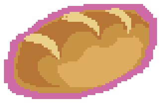
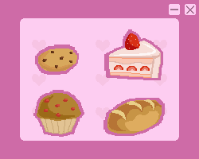
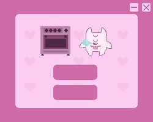
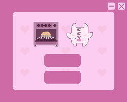

# bakingtimer

This will be based on egg timer app by @bizbunny . She found a video by nashallery that seemed fun to replicate fom what I'm told.

The goal of this project is to make a simple timer app to help teach myself Electron. The app will allow the user to set different times depending on the baked good chosen at the start.

# Process

## Electron

The project is mostly coded in the Javascript framework Electron for functionality, with some HTML and CSS for stylizing purposes.

## The assets

The art assets are drawn in Pixelorama. I wanted to keep on theme with the pixel art aesthetic, and Pixelorama is a drawing platform that allows you to draw in that style and is free on itch.io.

I separated the image assets into folder by screen aside from the main background and frame.

### Main background assets

#### The main background

#### The main frame

#### The Exit button

#### The minimize button

### Start Screen

#### Dog mascot

#### Start button

##### I'm also going to be using this as a baseplate button image for any other needed button

#### Talk bubble

### Picking which pastry

#### Bread button

#### Cake button

#### Cookie button

#### Muffin button

## What the screens will look like.

I have designed the assets around the dimensions of the app and what each screen will ideally look like in the final product. Below are what I had planned each screen to look like.

It was only during development I had realized I forgot crucial elements of this app, like the timing display, and some text to indicate to the user what was going on.

### The Start Screen

### Pastry Choice Menu Screen

### Timer Waiting Screen

### Timer Complete Screen

## The rest of the code

I started off, after installing Electron with the quick tutorial, getting a base place app. Once that worked, I could start stylizing with the Pixelify Sans font provided by the google fonts api, and add a custom background for my baking timer app.

All the art assets are designed by me in Pixelorama, a free pixel art app on itch.io. I would stylize the base plate app of each screen the best I could using the templates I made for myself shown above. Once each screen looked the way I planned it to. Then came coding the functionality.

### Code issues I faced

I came to a point where the app worked in the browser just fine, but when launching the app via npm, the functionality was gone. Some sources mention its how Electron works with its security. It's the contextisolation part. The renderer doesn't have access to Node.js but preload is supposed to fix that.

## sound attribution

Pop 9 by D.S.G. -- https://freesound.org/s/328119/ -- License: Creative Commons 0

Alarm Clock Digital by zanox -- https://freesound.org/s/233645/ -- License: Attribution NonCommercial 4.0

## recipes used for baking time

cookies: https://joyfoodsunshine.com/the-most-amazing-chocolate-chip-cookies/

cake: https://www.allrecipes.com/recipe/17481/simple-white-cake/

muffin: https://smittenkitchen.com/2010/08/perfect-blueberry-muffins/

bread: https://sallysbakingaddiction.com/homemade-artisan-bread/print/80079/
