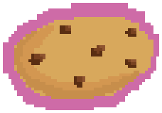

# bakingtimer

This will be based on egg timer app by @bizbunny . She found a video by nashallery that seemed fun to replicate fom what I'm told.

# Process

## Electron

The project is mostly coded in the Javascript framework Electron for functionality, with some HTML and CSS for stylizing purposes.

## The assets

The art assets are drawn in Pixelorama. I wanted to keep on theme with the pixel art aesthetic, and Pixelorama is a drawing platform that allows you to draw in that style and is free on itch.io.

I separated the image assets into folder by screen aside from the main background and frame.

### Main background assets

#### The main background

#### The main frame

#### The Exit button

#### The minimize button

### Start Screen

#### Dog mascot

#### Start button

#### Talk bubble

### Picking which pastry

#### Bread button

#### Cake button

#### Cookie button

#### Muffin button

## The rest of the code

I started off, after installing Electron with the quick tutorial to get a base place app. once that worked, I could start stylizing with the Pixelify Sanas font provided by the google fonts api, and add a custom background for my baking timer app.
